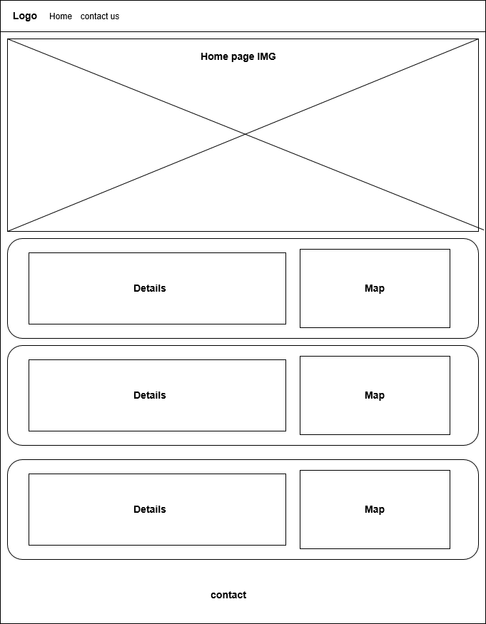

# mosques-service
this is my second project. It aims to serve mosques and provide what it needs.

## Contents
* [Website Like](#website-link)
* [Technologies](#technologies)
* [Future Work](#Future-work)
## Website Like
https://sara-kuddah.github.io/mosques-service/
## Technologies
* React js
* Bootsrap
* CSS
* Postman
* VS code
* JSX
## Wireframes

## User Story
1. The user can Add a new comment Item to the comment list.
2. The user can Select one comment and Edit it.
3. The user can Select items and delete.
4. The user can Clear all items.
## Future Work
- There is a lote to do one this project after finsh my SE course 